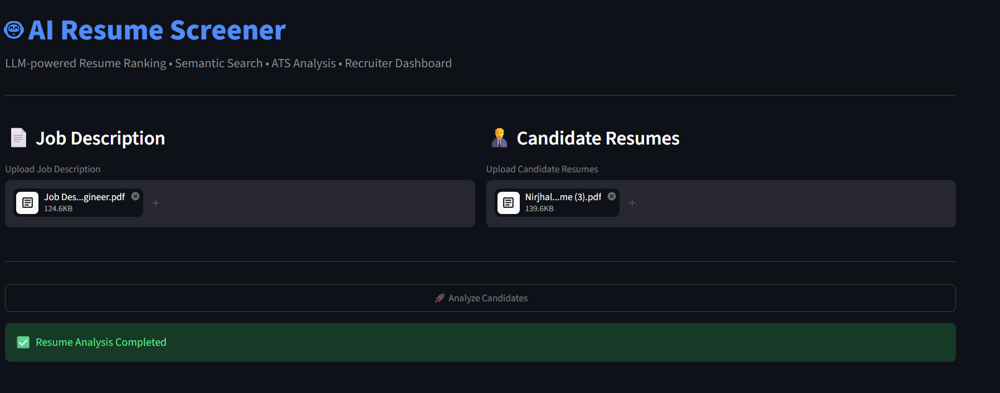
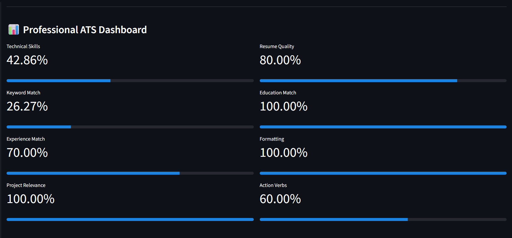
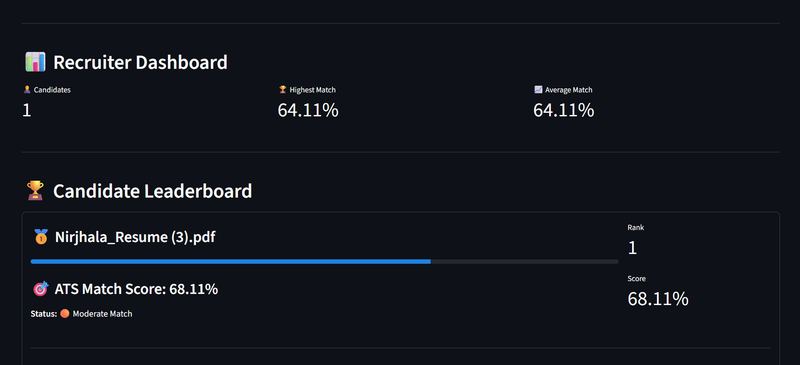
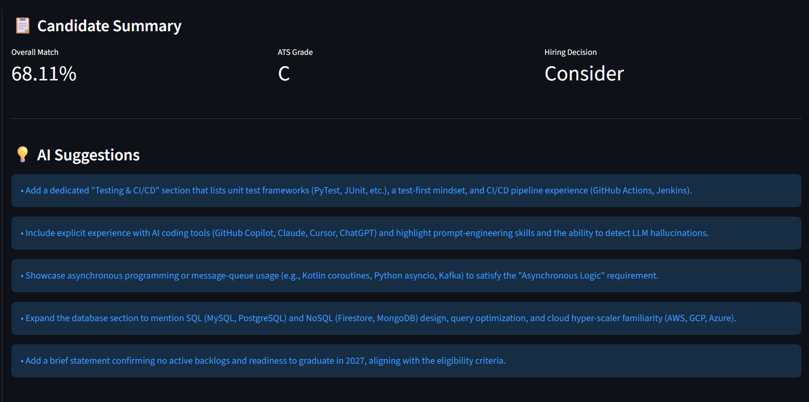
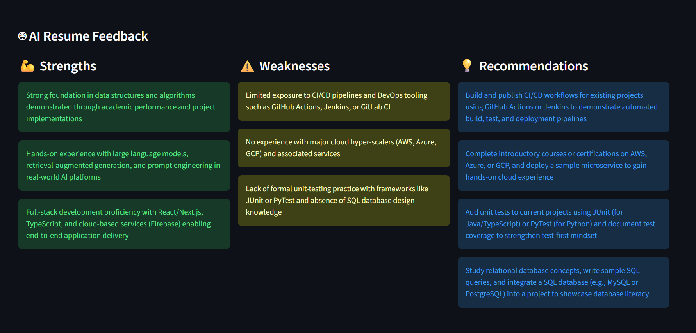
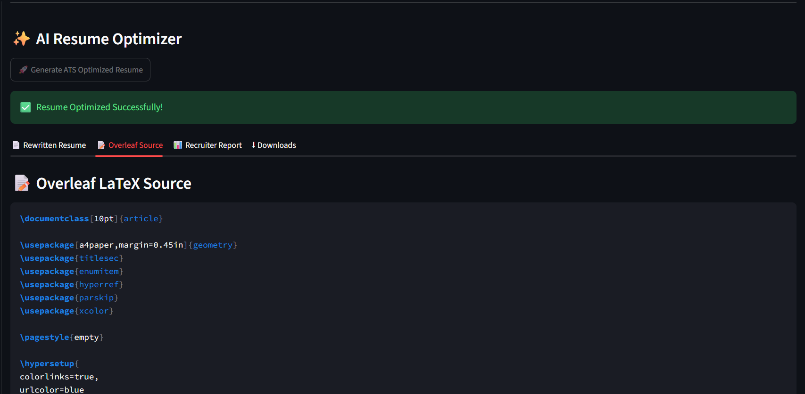
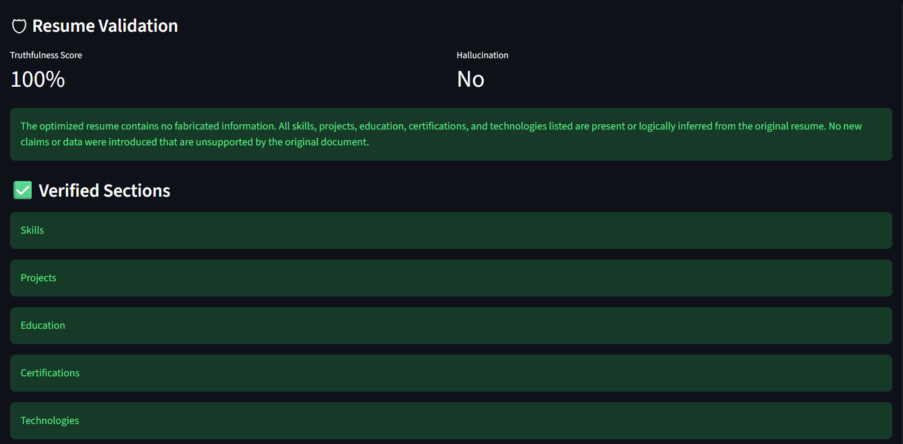
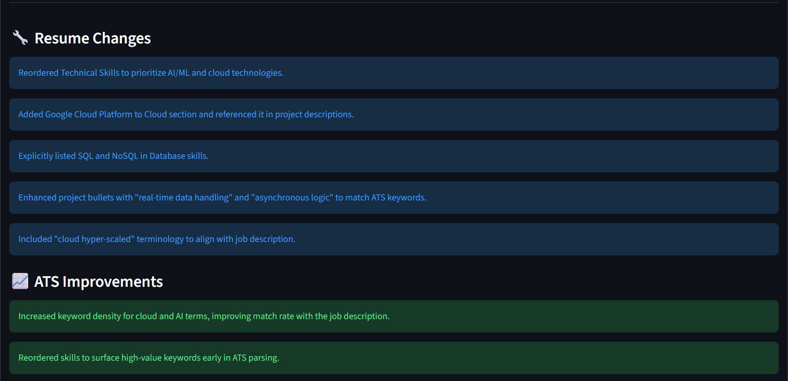
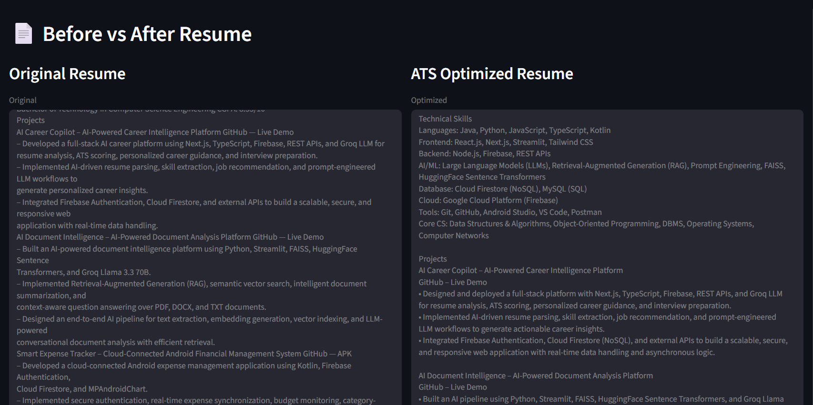
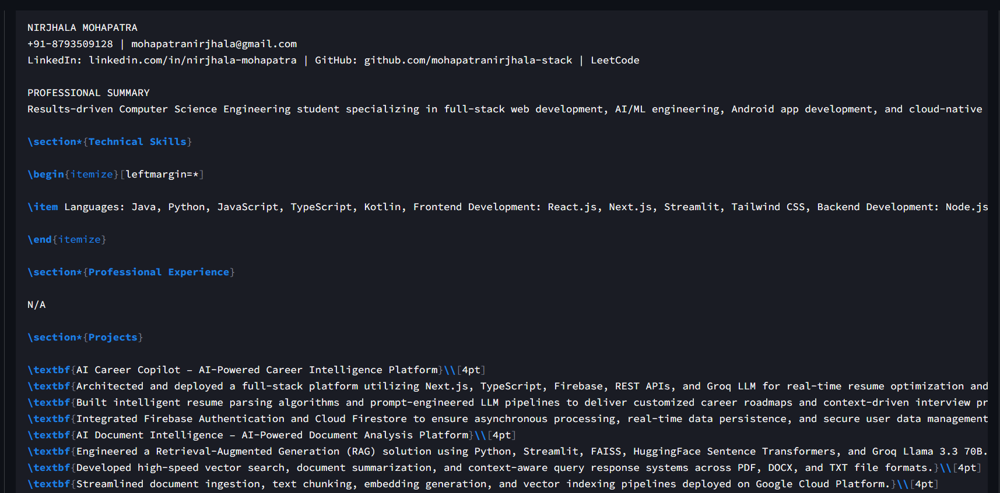

🚀 AI Resume Screener

«An AI-powered Resume Screening & ATS Analysis Platform with Multi-LLM Architecture (Gemini, OpenRouter & Groq)»

⭐ No installation required. Upload a Job Description and Resume to experience the complete AI-powered screening workflow.

📌 Overview

AI Resume Screener is an intelligent recruitment assistant designed to automate resume screening using Artificial Intelligence and ATS-based evaluation.

Unlike traditional keyword matchers, this platform combines a rule-based ATS engine with Large Language Models (LLMs) to provide recruiter-level insights, resume validation, optimisation, skill-gap analysis, and professional recommendations.

The system supports multiple AI providers, distributing workloads across Google Gemini, OpenRouter, and Groq to improve reliability, optimise API usage, and minimise dependency on a single provider.

Whether you're a recruiter reviewing candidates or a job seeker optimising a resume, the platform delivers comprehensive insights to improve hiring decisions and resume quality.

---

✨ Key Features

- 📄 Upload and analyse multiple resumes
- 🎯 Professional ATS score calculation
- 📊 Advanced resume evaluation dashboard
- 🏆 Candidate leaderboard with ranking
- 🤖 AI-powered recruiter recommendations
- 💬 AI-generated strengths, weaknesses and feedback
- 📈 Skill matching and skill-gap analysis
- ✍️ AI Resume Optimiser
- 📑 Resume Validation Engine
- 📝 Professional Resume Rewriter
- 📋 Candidate Summary Generation
- 📄 Overleaf/LaTeX Resume Export
- 💡 Resume Improvement Suggestions
- 👔 Hiring Decision Assistance
- ⚡ Multi-LLM Architecture for intelligent workload distribution

---

🧠 Multi-LLM Architecture

This project intelligently distributes AI workloads across multiple providers.

AI Provider| Responsibility
Google Gemini| Recruiter Analysis, Resume Rewriter
OpenRouter| ATS Scoring, AI Feedback, Resume Validation, Resume Optimiser, Resume Improvements
Groq| Hiring Decision

This architecture improves scalability, reduces API quota exhaustion, and increases overall system reliability.

---

🎯 Use Cases

- HR & Recruitment Teams
- Resume Screening Automation
- Applicant Tracking System (ATS) Enhancement
- Campus Hiring
- Technical Recruitment
- Resume Optimisation
- Career Guidance
- Placement Preparation

---

🛠️ Tech Stack

Category| Technologies
Programming Language| Python 3
Frontend/UI| Streamlit
AI Providers| Google Gemini, OpenRouter, Groq
LLMs| Gemini Flash, GPT-OSS-20B, Llama 3.3 70B
Resume Processing| PyMuPDF, pdfplumber
Data Processing| Pandas, NumPy
Visualizations| Plotly
Environment Management| python-dotenv
Version Control| Git & GitHub

---

🏗️ System Architecture

                    Resume Upload
                          │
                          ▼
                  Resume Text Extraction
                          │
        ┌─────────────────┼─────────────────┐
        ▼                 ▼                 ▼
  ATS Rule Engine   Skill Matching    Resume Parsing
        │                 │                 │
        └─────────────────┼─────────────────┘
                          ▼
                 AI Analysis Layer
        ┌──────────────┬──────────────┬──────────────┐
        ▼              ▼              ▼
     Gemini       OpenRouter         Groq
        │              │              │
        └──────────────┼──────────────┘
                       ▼
             Final ATS Evaluation
                       │
                       ▼
            Recruiter Dashboard & Reports

---

🔄 Project Workflow

1. Upload one or more resumes.
2. Upload the target Job Description.
3. Extract resume text automatically.
4. Perform ATS keyword analysis.
5. Match technical and soft skills.
6. Generate section-wise ATS scores.
7. Produce AI recruiter insights.
8. Generate strengths, weaknesses and recommendations.
9. Optimise and rewrite resumes.
10. Validate resume quality.
11. Display ranked candidates with hiring recommendations.

---

# 📸 Application Screenshots

## 🏠 Home Page

---

## 📊 ATS Dashboard

---

## 🏆 Candidate Leaderboard

---

## 👤 Candidate Summary

---

## 🤖 AI Feedback

---

## ✍️ Resume Optimizer

---

## ✅ Resume Validation

---

## 📈 Improvement Suggestions

---

## 📝 Resume Rewriter (Before vs After)

---

## 📄 Overleaf / LaTeX Resume

⚙️ Installation

1️⃣ Clone the Repository

git clone https://github.com/mohapatranirjhala-stack/AI-Resume-Screener.git

cd AI-Resume-Screener

---

2️⃣ Create a Virtual Environment

Windows

python -m venv venv

Activate the virtual environment:

venv\Scripts\activate

macOS / Linux

python3 -m venv venv

source venv/bin/activate

---

3️⃣ Install Dependencies

pip install -r requirements.txt

---

4️⃣ Configure Environment Variables

Create a file named:

.env

Add your API keys:
GEMINI_API_KEY=your_gemini_api_key
OPENROUTER_API_KEY=your_openrouter_api_key
GROQ_API_KEY=your_groq_api_key

«Important: Never commit your ".env" file to GitHub.»

---

▶️ Run the Application

streamlit run app.py

The application will launch in your default browser.

---

📂 Project Structure

AI-Resume-Screener/
│
├── app.py
├── requirements.txt
├── README.md
├── assets/
├── utils/
├── uploads/
├── .gitignore
└── .env (local only)

---

💡 Highlights

- Multi-provider AI architecture for improved reliability
- Professional ATS scoring engine
- Resume optimisation and validation
- Recruiter-style AI recommendations
- Candidate ranking and leaderboard
- Modern Streamlit interface
- Secure API key management
- Modular and scalable codebase

---

🚀 Future Enhancements

- User authentication
- Recruiter dashboard with analytics
- Resume history and versioning
- Support for DOCX uploads
- AI-powered interview question generation
- Email report generation
- Export reports as PDF
- Cloud database integration
- Multi-user support
- Docker deployment

---

👩‍💻 Author

Nirjhala Mohapatra

Final Year B.Tech CSE Student | AI & Software Development Enthusiast

If you found this project useful, consider giving it a ⭐ on GitHub.
